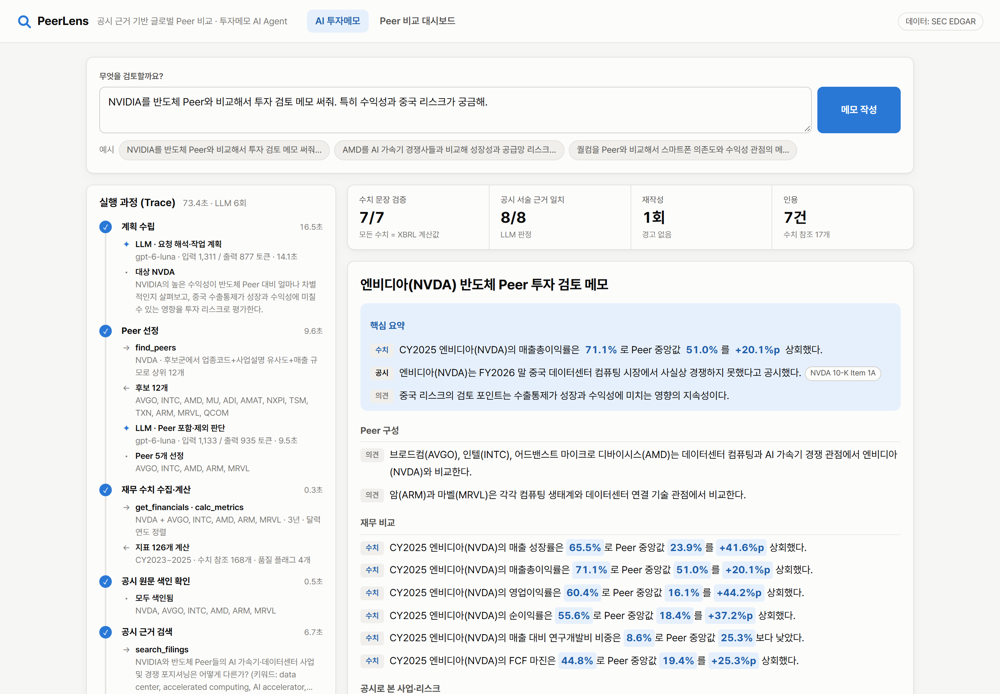

# PeerLens

공시 근거 기반 글로벌 Peer 비교·투자메모 AI Agent — 「국부펀드 KIC, AI 에이전트 공모전」 출품작.

> 현재 단계: Phase 1 PoC 완료 — XBRL 재무 비교 · 공시 원문 근거 검색 · Agent 루프 v0 · 평가



## 평가 결과 (질문 10개, 2026-10-07)

| 지표 | 결과 |
|---|---|
| 성공률 | 10/10 |
| 평균 소요 시간 | 58초 |
| 수치 일치율 (SEC 원본에서 독립 재계산) | 100% (184/184) |
| LLM이 직접 쓴 숫자 | 0개 |
| 인용 원문 존재율 (인용 문단의 모든 줄이 원문에 존재) | 97.1% (66/68) |
| 근거 일치율 (다른 모델의 독립 재판정) | 98.8% (79/80) |

상세: [eval/REPORT.md](eval/REPORT.md) · 재현: `python eval/run_eval.py`

## Agent 구조 (LangGraph)

```
요청 → plan → peers → financials → ensure_index → research → analyze → write → verify ─┬→ finalize → (PDF)
                                                                             ↑          │ 실패 & 재시도 < 2
                                                                             └─ revise ←┘
```

| 노드 | 하는 일 | 사용 도구 / 모델 |
|---|---|---|
| plan | 요청 해석 → 대상·Peer·강조 지표·근거 질문(한/영) 계획 | GPT (fast) |
| peers | 후보 점수(사업설명 임베딩 유사도·SIC·매출 규모) → 요청 관점으로 포함·제외 판단 | find_peers, GPT (fast) |
| financials | XBRL 수집·지표 계산 → 수치 참조 목록 생성 | get_financials, calc_metrics |
| ensure_index | 원문 색인이 없는 Peer는 자동 색인 | index_filings |
| research | 근거 질문마다 기업별 할당 검색 (임베딩·리랭커 1회) | search_filings |
| analyze | 수치·근거로 논지·인사이트(강점·약점·동인·리스크)·Peer 대비·확인 항목 설계 | GPT (main) |
| write | 출처 달린 메모. **숫자는 `[[참조ID]]`로만** 쓰고 값은 코드가 채움 | GPT (main) |
| verify | 규칙 검사(직접 쓴 숫자·없는 참조·근거 누락) + 문장-근거 일치 판정 | GPT (fast) |
| revise | 실패 문장만 재검색·재작성 (최대 2회), 이후에도 실패면 ⚠ 표시 | search_filings, GPT (main) |
| (PDF) | 검증된 메모·비교표·Peer 선정 근거·출처(원문 위치 링크)를 A4 PDF로 | render_report (Playwright) |

**사람의 개입**: 화면의 Peer 선정 표에서 체크를 끄거나 기업을 추가한 뒤 '이 Peer로 다시 실행'을 누르면,
같은 요청을 고친 Peer 구성으로 다시 분석한다(Agent의 Peer 판단 단계는 건너뛰고 사용자 구성을 그대로 사용, 수정 전 메모와 연결).

```bash
peerlens agent "NVIDIA를 반도체 Peer와 비교해서 투자 검토 메모 써줘. 특히 수익성과 중국 리스크가 궁금해."
```

실행 기록(계획·도구 호출·LLM 토큰·검증 결과 전체)은 `data/runs/{run_id}.json`에 저장되고, 웹 화면 'AI 투자메모' 탭에서 실시간 Trace로 볼 수 있다.

## 빠른 실행

```bash
python -m venv .venv
.venv/Scripts/activate          # macOS/Linux: source .venv/bin/activate
pip install -e ".[dev]"
playwright install chromium     # 메모 PDF 내보내기용 (1회)
cp .env.example .env            # SEC_USER_AGENT에 이름과 이메일 입력
peerlens compare NVDA AMD INTC AVGO QCOM TSM ASML --years 3
peerlens index NVDA AMD INTC AVGO QCOM TSM   # 공시 원문 색인 (.env에 COHERE_API_KEY 필요, 웹 서버는 꺼 둔 상태로)
peerlens search "고객 집중 리스크" --tickers NVDA --keywords "customer concentration"
pytest                          # 단위 테스트 (네트워크 불필요)
pytest -m live                  # SEC 실데이터 회귀 테스트
```

### 웹 데모 실행

```bash
cd web && npm ci && npm run build && cd ..     # 웹 화면 빌드 (web/dist)
uvicorn peerlens.api:app --port 8000          # http://localhost:8000
```

화면 개발 중에는 `uvicorn ... --reload`와 `cd web && npm run dev`(http://localhost:5173, /api는 8000으로 프록시)를 함께 띄운다.

Docker (배포용, 서버·URL 1개):

```bash
docker build -t peerlens .
docker run -p 8000:8000 -e SEC_USER_AGENT="이름 이메일" peerlens
```

| API | 설명 |
|---|---|
| `GET /api/companies?q=` | 티커·회사명 검색 |
| `POST /api/compare` | `{target, peers[], years, align}` → 비교표 셀·Peer 중앙값 |
| `GET /api/metrics/{metric_id}` | 지표 계산식 + 입력 원값의 공시 출처 |
| `GET /api/evidence?q=` | 공시 원문 근거 검색 |
| `GET /api/agent/stream?q=&peers=&parent=` | Agent 실행 (Server-Sent Events로 Trace 실시간 전송, 마지막에 결과). `peers`=사용자가 고친 Peer 구성 |
| `GET /api/agent/runs`, `/api/agent/runs/{id}` | 실행 기록 목록·상세 |
| `GET /api/agent/runs/{id}/pdf` | 투자 검토 메모 PDF (`data/reports/` 캐시) |

CLI 출력: 터미널 비교표 + `data/output/` 에 `*_facts.csv`(원값·출처), `*_metrics.csv`(계산식·입력 fact_id·품질 플래그), `*_dataset.json`.

## 데이터 파이프라인 설계

| 단계 | 모듈 | 처리 |
|---|---|---|
| 수집 | `edgar/client.py` | companyfacts·submissions API, User-Agent 필수, 초당 8회 제한, 지수 백오프, `data/cache/` 캐시(수집일 기록) |
| 태그 매핑 | `metrics/tags.py` | 표준 지표 10종 → us-gaap/ifrs-full 태그 우선순위. 정의가 다른 대체 태그는 `proxy_tag` 플래그 |
| 기간 정렬 | `metrics/facts.py` | 연간 공시(10-K/20-F/40-F) 중 기간 350~380일 값만, 같은 기간은 최신 공시 값(재작성 시 `restated` + 최초값 보존), 회계연도·달력연도 동시 부여 |
| 원문 수집·분할 | `edgar/filings.py` | 최신 10-K/20-F 원문 → 문단 블록 → 사업·위험요인·MD&A·시장위험 섹션 (Item 제목 / 목차 기반 / PDF 줄 복원) |
| 청킹 | `retrieval/chunking.py` | 문단 경계 유지 ~2,200자, 재무표 행 제외, 청크마다 공시·섹션·소제목·원문 위치 링크(Text Fragment) |
| 검색 | `retrieval/index.py` | Cohere 임베딩(의미) + BM25(키워드) → RRF 결합 → Cohere 리랭커. 단계별 순위를 결과에 기록 |
| 계산 | `metrics/calc.py` | 성장률·매출총이익률·영업이익률·순이익률·ROE(평균자본)·R&D 비중·FCF 마진. 값마다 계산식·입력 fact_id·플래그 |

모든 Fact는 기업, CIK, 공시 종류, 접수번호, 공시일, 회계기간, taxonomy·태그, 공시 원문 URL, API URL, 수집일을 가진다.

## 비용 관리 (개발·테스트)

| 설정 (`.env`) | 내용 |
|---|---|
| `PEERLENS_LLM_PROVIDER=gemini` | 개발 중엔 Gemini 무료 등급으로 Agent 전체 실행 (정식 구성·최종 평가는 `openai`) |
| `GEMINI_FALLBACK_MODELS` | 무료 등급 과부하(503) 시 넘어갈 대체 모델 |
| `PEERLENS_LLM_CACHE=1` | 같은 입력이면 저장된 LLM 응답 재사용 (`data/llm_cache`) |
| `PEERLENS_PROFILE=dev` | 모든 단계를 빠른(저가) 모델로 |
| `PEERLENS_RUN_TOKEN_BUDGET` | 실행 1건 토큰 상한 — 넘으면 재작성 생략 |

평가: `python eval/run_eval.py`(3문항·LLM 채점 끔) / `--judge`(채점) / `--full`(10문항 + 채점, 최종 확인용)

## 외부 데이터·라이브러리 출처 및 라이선스

| 구분 | 항목 | 용도 | 출처·조건 |
|---|---|---|---|
| 데이터 | SEC EDGAR XBRL API (companyfacts, submissions, company_tickers) | 재무 수치, 기업 정보 | sec.gov 공개 데이터. [접근 정책](https://www.sec.gov/os/accessing-edgar-data) 준수 (User-Agent, 10 req/s 이하) |
| 데이터 | SEC EDGAR 공시 원문 (10-K, 20-F) | 근거 문단 검색 | 동일 (sec.gov 공개 데이터) |
| 모델·API | OpenAI GPT (`gpt-6-sol` 작성·재작성, `gpt-6-luna` 계획·Peer 판단·검증) | Agent LLM (정식 구성) | [OpenAI 이용약관](https://openai.com/policies/terms-of-use), 유료 API. 모델명은 `.env`로 교체 |
| 모델·API | Google Gemini (`gemini-3.6-flash`, 대체 `gemini-3.5-flash`·`gemini-3-flash-preview`) | Agent LLM (개발·테스트용) | [Gemini API 이용약관](https://ai.google.dev/gemini-api/terms), 무료 등급 — 입력이 서비스 개선에 쓰일 수 있어 공개 공시 데이터만 사용 |
| 오픈소스 | google-genai | Gemini 호출 | Apache-2.0 |
| 모델·API | Cohere Embed v4 (`embed-v4.0`) | 공시 문단·질문 임베딩 | [Cohere 이용약관](https://cohere.com/terms-of-use), 유료 API (개발 중 체험판 키) |
| 모델·API | Cohere Rerank 4.0 Fast (`rerank-v4.0-fast`) | 검색 결과 재순위 | 동일 |
| 오픈소스 | LangGraph | Agent 상태 그래프 (분기·재시도) | MIT |
| 오픈소스 | openai (Python SDK), pydantic | LLM 호출·출력 스키마 강제 | Apache-2.0 / MIT |
| 오픈소스 | Qdrant (qdrant-client) | 벡터 검색 (dense + sparse) | Apache-2.0 |
| 오픈소스 | BeautifulSoup4, lxml | 공시 HTML 파싱 | MIT / BSD-3-Clause |
| 오픈소스 | httpx | HTTP 클라이언트 | BSD-3-Clause |
| 오픈소스 | pandas | 표 계산 | BSD-3-Clause |
| 오픈소스 | python-dotenv | 환경변수 | BSD-3-Clause |
| 오픈소스 | tabulate | 표 출력 | MIT |
| 오픈소스 | pytest | 테스트 | MIT |
| 오픈소스 | FastAPI, uvicorn | API 서버 | MIT / BSD-3-Clause |
| 오픈소스 | React, Vite, TypeScript | 웹 화면 | MIT / MIT / Apache-2.0 |
| 오픈소스 | Playwright (Chromium) | 메모 PDF 생성, 평가용 화면 캡처 | Apache-2.0 (Chromium: BSD-3-Clause) |
| 글꼴 | Noto Sans CJK (Docker 이미지) | PDF 한글 표시 | SIL Open Font License 1.1 |
| 폰트 | Pretendard | 웹 화면 글꼴 | SIL Open Font License 1.1 |
| 생성형 AI | Claude (Anthropic) | 코드 작성 보조 | 최종 코드는 참가자가 검토 |
